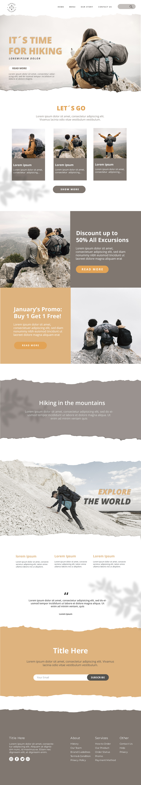

# summer-exploring(SENAC)
https://vinnyalmeidabr.github.io/Visual.SummerExploring/

# Site single page - HTML, PHP, CSS e JS utilizando o BOOTSTRAP.

# Summer-exploring 
Site Single page - HTML, CSS e JavaScript utilizando BOOTSTRAP 

# DESAFIO 
O desafio foi transformar em código um layout do site em imagem JPG  
Veja a imagem:  

## Consumo de APis 
Foi utilizado um código javascript para popular os campos 
select com uma lista dos estados e após a seleção, é 
carregado no select "cidades" uma lista com as cidades do esado selecionado. 

## Bibliotecas utilizadas 
 - Boostrap
 - FontAwesome 
 - AOS Scroll Animation
 - Google Fonts 
 - Etc
